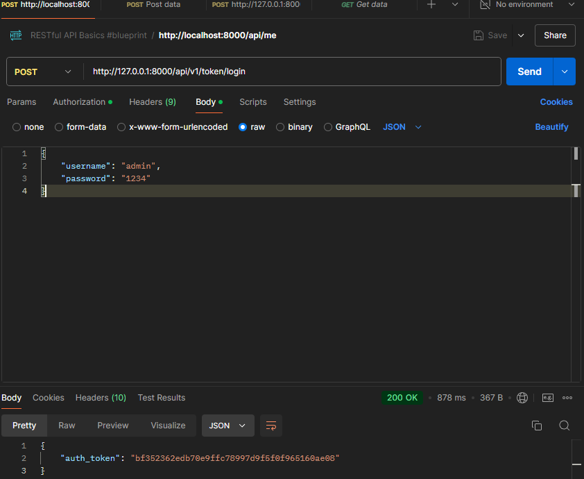

# Руководство программиста
### Таблицы:
- **User**: Таблица пользователей.
- **Post**: Таблица постов.
- **Comment**: Таблица комментариев.
- **Category**: Таблица категорий.

### Связи:
- **Post** связан с **User** через поле `owner` 
- **Comment** связан с **User** через поле `owner` 
- **Comment** связан с **Post** через поле `post` 
- **Category** связан с **User** через поле `owner` 
- **Category** связан с **Post** через поле `posts` 

## Работа с классами `generics`

Django REST Framework предоставляет классы `generics`, которые упрощают создание представлений (views) для CRUD-операций. Вот примеры использования:

### Примеры классов `generics`:

python
from rest_framework import generics
from .models import Post, Comment, Category
from .serializers import PostSerializer, CommentSerializer, CategorySerializer

# Представление для списка всех постов и создания нового поста
class PostList(generics.ListCreateAPIView):
    queryset = Post.objects.all()
    serializer_class = PostSerializer

# Представление для отображения, обновления и удаления конкретного поста
class PostDetail(generics.RetrieveUpdateDestroyAPIView):
    queryset = Post.objects.all()
    serializer_class = PostSerializer

# Представление для списка всех комментариев и создания нового комментария
class CommentList(generics.ListCreateAPIView):
    queryset = Comment.objects.all()
    serializer_class = CommentSerializer

# Представление для отображения, обновления и удаления конкретного комментария
class CommentDetail(generics.RetrieveUpdateDestroyAPIView):
    queryset = Comment.objects.all()
    serializer_class = CommentSerializer

# Представление для списка всех категорий и создания новой категории
class CategoryList(generics.ListCreateAPIView):
    queryset = Category.objects.all()
    serializer_class = CategorySerializer

# Представление для отображения, обновления и удаления конкретной категории
class CategoryDetail(generics.RetrieveUpdateDestroyAPIView):
    queryset = Category.objects.all()
    serializer_class = CategorySerializer


Назначение прав доступа (`permissions`)

Права доступа управляют тем, кто может выполнять определенные действия с объектами. В Django REST Framework есть несколько встроенных разрешений, а также возможность создавать собственные.

### Примеры разрешений:

python
from rest_framework import permissions

# Разрешение, которое позволяет только владельцу объекта его редактировать или удалять
class IsOwnerOrReadOnly(permissions.BasePermission):
    def has_object_permission(self, request, view, obj):
        if request.method in permissions.SAFE_METHODS:
            return True
        return obj.owner == request.user

# Применение разрешений в представлениях
class PostDetail(generics.RetrieveUpdateDestroyAPIView):
    queryset = Post.objects.all()
    serializer_class = PostSerializer
    permission_classes = [permissions.IsAuthenticatedOrReadOnly, IsOwnerOrReadOnly]

### Описание:
- **IsAuthenticatedOrReadOnly**: Разрешает доступ только аутентифицированным пользователям для изменения данных, а всем остальным – только чтение.
- **IsOwnerOrReadOnly**: Разрешает доступ к объекту только его владельцу для изменения или удаления.

## Работа в Postman

Postman – это инструмент для тестирования API. Вот как можно использовать Postman для работы с вашим API:

### 1. Установка и настройка Postman
- Скачайте и установите Postman с [официального сайта](https://www.postman.com/downloads/).
- Создайте новый рабочий профиль и настройте окружение для вашего API.

### 2. Тестирование API

#### Получение списка постов
- **Метод**: GET
- **URL**: `http://localhost:8000/posts/`
- **Описание**: Получение списка всех постов.

#### Создание нового поста
- **Метод**: POST
- **URL**: `http://localhost:8000/posts/`
- **Тело запроса**:
  ```json
  {
      "title": "Пост",
      "body": "Тело поста"
  }

- **Описание**: Создание нового поста.

#### Получение конкретного поста
- **Метод**: GET
- **URL**: `http://localhost:8000/posts/<id>/`
- **Описание**: Получение информации о конкретном посте по его ID.

#### Обновление поста
- **Метод**: PUT
- **URL**: `http://localhost:8000/posts/<id>/`
- **Тело запроса**:
  ```json
  {
      "title": "Обновленный пост",
      "body": "Обновленное тело поста"
  }

- **Описание**: Обновление информации о конкретном посте по его ID.

Удаление поста
- **Метод**: DELETE
- **URL**: `http://localhost:8000/posts/<id>/`
- **Описание**: Удаление конкретного поста по его ID.

Аутентификация
- Если ваше API требует аутентификации, используйте вкладку `Authorization` в Postman для настройки токена или базовой аутентификации.

